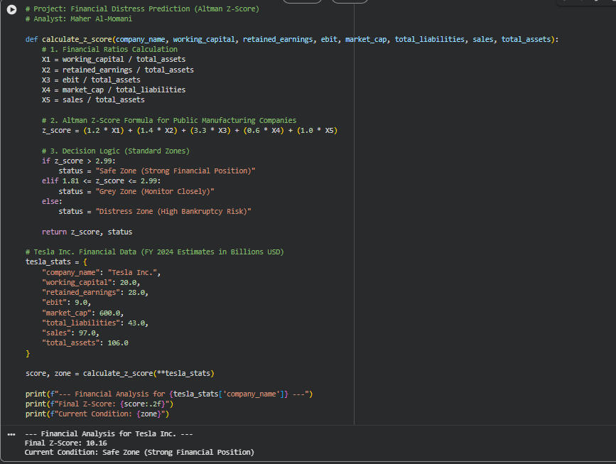
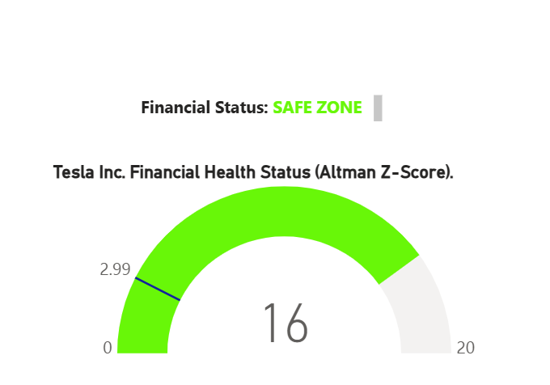

# Tesla Inc. Financial Stability Analysis (Altman Z-Score Model)

## 📌 Project Overview
This project applies the **Altman Z-Score** formula to evaluate the financial health and bankruptcy risk of **Tesla Inc.** for the fiscal year 2024. As a modern accountant, I used **Python** to automate these calculations, moving beyond traditional spreadsheet manual entry.

## 📊 The Model
The Altman Z-Score is a world-renowned predictive model that uses five financial ratios:
- **X1 (Liquidity):** Working Capital / Total Assets
- **X2 (Profitability):** Retained Earnings / Total Assets
- **X3 (Efficiency):** EBIT / Total Assets
- **X4 (Solvency):** Market Value of Equity / Total Liabilities
- **X5 (Asset Turnover):** Sales / Total Assets

## 🚀 Key Features
- **Automation:** Calculation logic built with Python.
- **Decision Logic:** Categorizes results into **Safe**, **Grey**, or **Distress** zones.
- **Professional Insights:** Real-world data application for Tesla Inc.

## 🛠️ Technology Stack
- **Language:** Python 3.x
- **Platform:** GitHub (Version Control)
- **Domain:** Financial Analysis & Risk Management 
- **Financial Modeling:** Microsoft Excel (v1.0 included)
  
## 📊 Analysis Output
Below is the actual output from the Python model verifying Tesla's financial health:

*The model confirms a Z-Score of 10.16, indicating a very strong financial position.
---
**Prepared by: Maher Al-Momani**
*Accounting & Data Analysis Professional | CMA Candidate | Dubai, UAE 🇦🇪*
